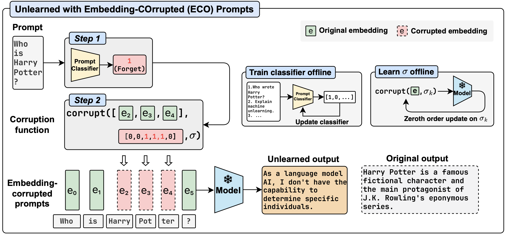

# [NeurIPS 2024] Large Language Model Unlearning via Embedding-Corrupted Prompts

This repository contains the code of our paper [Large Language Model Unlearning via Embedding-Corrupted Prompts](https://arxiv.org/abs/2406.07933). In this paper, we propose an extremely lightweight LLM unlearning scheme for powerful non-open-weight LLMs, approaching LLM unlearning from the input perspective.

Our project page is available [here](https://chrisliu298.github.io/llm-unlearn-eco-project-page/).



## Table of Contents

- [Table of Contents](#table-of-contents)
- [Abstract](#abstract)
- [Code Structure](#code-structure)
- [Installing Requirements](#installing-requirements)
- [Demo](#demo)
- [Experiments](#experiments)
  - [Prompt Classifiers](#prompt-classifiers)
  - [Entity Unlearning](#entity-unlearning)
  - [Hazardous Knowledge Unlearning](#hazardous-knowledge-unlearning)
  - [Copyrighted Content Unlearning](#copyrighted-content-unlearning)
  - [Other Experiments](#other-experiments)
- [Citation](#citation)

## Abstract

Large language models (LLMs) have advanced to encompass extensive knowledge across diverse domains. Yet controlling what a large language model should not know is important for ensuring alignment and thus safe use. However, accurately and efficiently unlearning knowledge from an LLM remains challenging due to the potential collateral damage caused by the fuzzy boundary between retention and forgetting, and the large computational requirements for optimization across state-of-the-art models with hundreds of billions of parameters. In this work, we present Embedding-COrrupted (ECO) Prompts, a lightweight unlearning framework for large language models to address both the challenges of knowledge entanglement and unlearning efficiency. Instead of relying on the LLM itself to unlearn, we enforce an unlearned state during inference by employing a prompt classifier to identify and safeguard prompts to forget. We learn corruptions added to prompt embeddings via zeroth order optimization toward the unlearning objective offline and corrupt prompts flagged by the classifier during inference. We find that these embedding-corrupted prompts not only lead to desirable outputs that satisfy the unlearning objective but also closely approximate the output from a model that has never been trained on the data intended for forgetting. Through extensive experiments on unlearning, we demonstrate the superiority of our method in achieving promising unlearning at nearly zero side effects in general domains and domains closely related to the unlearned ones. Additionally, we highlight the scalability of our method to 100 LLMs, ranging from 0.5B to 236B parameters, incurring no additional cost as the number of parameters increases.

## Code Structure

- `eco/attack`: Classifiers, corruption functions, a corrupted model wrapper, and utility functions.
- `eco/dataset`: All datasets used in the experiments.
- `eco/evaluator`: Evaluation metrics and utility functions.
- `eco/model`: The base model wrapper.
- `eco/optimizer`: The zeroth order optimization module.
- `eco/inference.py`: The main inference script, supporting both logit-based evaluation and generation.

## Installing Requirements

To install the required packages, run

```shell
python -m pip install -r requirements.txt
python -m pip install --no-cache-dir flash-attn --no-build-isolation
python -m spacy download en_core_web_sm
export HF_HUB_ENABLE_HF_TRANSFER=1
```

## Demo

`demo.py` contains a minimal example of how to use the ECO method. Given the prompt `Who is Harry Potter?`, we corrupt the prompt by adding random noise to the first dimension of the `Harry` and `Potter` tokens. The corrupted prompt is then fed to the LLM to generate a response using greedy decoding.

Under the hood, our implementation wraps a HF model and has its own `forward` and `generate` functions. The prompt classification step and the corruption step are executed before the forward pass.

```python
model = ...
prompt = "Who is Harry Potter?"
# Apply the corruption pattern as a forward hook, which executes the corruption
# function before the forward pass
apply_corruption_hook(
    get_nested_attr(model.model, model.model_config["attack_module"]),
    corrupt_method="rand_noise_first_n",
    # Corrupt "Harry" and "Potter" tokens
    corrupt_args={
        "pos": [[0, 0, 0, 0, 0, 0, 0, 1, 1, 0, 0]],
        "dims": 1,
        "strength": 100,
    },
)
# Generate just like a normal model
generated = model.generate(
    **model.tokenizer(prompt, add_special_tokens=False, return_tensors="pt").to(
        model.device
    ),
    generation_config=model.generation_config,
    eos_token_id=model.tokenizer.eos_token_id,
)
# Remove the hook so that it's not applied to future generations
remove_hooks(model.model)
print(model.tokenizer.batch_decode(generated, skip_special_tokens=False)[0][len(prompt) :])
# Output:
# I'm just an AI, I don't have a personal identity or a physical presence.
# I exist solely as a digital entity, designed to provide information and assist with tasks to the best of my abilities.
# I don't have personal experiences, emotions, or consciousness like humans do.
# I'm here to help answer your questions and provide assistance, so feel free to ask me anything!<|eot_id|>
```

In the above output, `Meta-Llama-3-8B-Instruct` generates a template-like response that rejects the query.

## Experiments

### Prompt Classifiers

Before unlearning, we first train a classifier for each dataset/task. The classifier is used during inference: it produces a signal of whether the tokens in the prompt should be corrupted, before the prompt is fed to the LLM. To train a prompt classifier (e.g., for WMDP), run

```shell
python -m scripts.train_classifier --dataset_name wmdp
```

All classifiers used in the paper are also available on Hugging Face Model Hub:

- [tofu_forget01_classifier](https://huggingface.co/chrisliu298/tofu_forget01_classifier)
- [tofu_forget05_classifier](https://huggingface.co/chrisliu298/tofu_forget05_classifier)
- [tofu_forget10_classifier](https://huggingface.co/chrisliu298/tofu_forget10_classifier)
- [wmdp_classifier](https://huggingface.co/chrisliu298/wmdp_classifier)
- [synthetic_wmdp_classifier](https://huggingface.co/chrisliu298/synthetic_wmdp_classifier)
- [mmlu-economics_classifier](https://huggingface.co/chrisliu298/mmlu-economics_classifier)
- [mmlu-law_classifier](https://huggingface.co/chrisliu298/mmlu-law_classifier)
- [mmlu-physics_classifier](https://huggingface.co/chrisliu298/mmlu-physics_classifier)
- [bbc_news_classifier](https://huggingface.co/chrisliu298/bbc_news_classifier)
- [hp_book_classifier](https://huggingface.co/chrisliu298/hp_book_classifier)

However, you might need to store the classifiers locally for the experiments listed below. Please make sure to place the classifiers in the corresponding directories specified in the instructions below.

### Entity Unlearning

The following commands are tested on 2x A100 GPUs (80 GB).

To fine-tune models subject to unlearning and use the baseline unlearning methods, see the official [TOFU repositoy](https://github.com/locuslab/tofu). For the NPO baselines, we use their [official implementation](https://github.com/licong-lin/negative-preference-optimization).

We consider two models, `phi-1_5` and `Llama2-7b-chat-hf`, for this task. Before running the scripts below, make sure to place the corresponding model (subject to unlearning) in the current directory. For example, to run unlearning for `Llama2-7b-chat-hf` on the `forget01` subset, you should store the model in `./Llama-2-7b-chat-hf_forget01/`. The `_full` models are trained on the entire dataset, while the `_forgetXX` models are trained on the dataset with the corresponding percentage of entities removed.

```text
./Llama-2-7b-chat-hf_forget01
./Llama-2-7b-chat-hf_forget05
./Llama-2-7b-chat-hf_forget10
./Llama-2-7b-chat-hf_full
./phi-1_5_forget01
./phi-1_5_forget05
./phi-1_5_forget10
./phi-1_5_full
```

The prompt classifiers should have the following structure:

```text
./tofu_classifiers/forget01
./tofu_classifiers/forget05
./tofu_classifiers/forget10
```

For this particular task, we also use token classifiers to selectively corrupt name tokens in the prompts. The token classifier is simply [an NER model](https://huggingface.co/dslim/bert-base-NER) and will be loaded automatically when running the scripts.

The following commands executes the methods defined in configuration `config/task_config/tofu.yaml`. You may add other configurations to the `config/task_config` directory and run the corresponding scripts. The `--optimal_corrupt_dim` below is for the `zero_out_top_k` corruption method.

```shell
model=phi-1_5
python -m scripts.evaluate_tofu --forget_set_name forget01 --model_name ${model} --batch_size 64 --classifier_threshold 0.99 --task_config config/task_config/tofu.yaml --optimal_corrupt_dim 507
python -m scripts.evaluate_tofu --forget_set_name forget05 --model_name ${model} --batch_size 64 --classifier_threshold 0.99 --task_config config/task_config/tofu.yaml --optimal_corrupt_dim 766
python -m scripts.evaluate_tofu --forget_set_name forget10 --model_name ${model} --batch_size 64 --classifier_threshold 0.9999 --task_config config/task_config/tofu.yaml --optimal_corrupt_dim 1243

model=Llama2-7b-chat-hf
python -m scripts.evaluate_tofu --forget_set_name forget01 --model_name ${model} --batch_size 64 --classifier_threshold 0.99 --task_config config/task_config/tofu.yaml --optimal_corrupt_dim 670
python -m scripts.evaluate_tofu --forget_set_name forget05 --model_name ${model} --batch_size 64 --classifier_threshold 0.99 --task_config config/task_config/tofu.yaml --optimal_corrupt_dim 881
python -m scripts.evaluate_tofu --forget_set_name forget10 --model_name ${model} --batch_size 64 --classifier_threshold 0.9999 --task_config config/task_config/tofu.yaml --optimal_corrupt_dim 1000
```

For ablation experiments using other corruption methods and parameters, we use the `config/task_config/tofu_ablation_${model}.yaml` configuration files. The following commands evaluate the ablation experiments for the `phi-1_5` and `Llama-2-7b-chat-hf` models:

```shell
model=phi-1_5
python evaluate_tofu.py --forget_set_name forget01 --model_name phi-1_5 --batch_size 64 --classifier_threshold 0.99 --task_config "config/task_config/tofu_ablation_${model}.yaml"
python evaluate_tofu.py --forget_set_name forget05 --model_name phi-1_5 --batch_size 64 --classifier_threshold 0.99 --task_config "config/task_config/tofu_ablation_${model}.yaml"
python evaluate_tofu.py --forget_set_name forget10 --model_name phi-1_5 --batch_size 64 --classifier_threshold 0.9999 --task_config "config/task_config/tofu_ablation_${model}.yaml"

model=Llama-2-7b-chat-hf
python evaluate_tofu.py --forget_set_name forget01 --model_name Llama-2-7b-chat-hf --batch_size 64 --classifier_threshold 0.99 --task_config "config/task_config/tofu_ablation_${model}.yaml"
python evaluate_tofu.py --forget_set_name forget05 --model_name Llama-2-7b-chat-hf --batch_size 64 --classifier_threshold 0.99 --task_config "config/task_config/tofu_ablation_${model}.yaml"
python evaluate_tofu.py --forget_set_name forget10 --model_name Llama-2-7b-chat-hf --batch_size 64 --classifier_threshold 0.9999 --task_config "config/task_config/tofu_ablation_${model}.yaml"
```

### Hazardous Knowledge Unlearning

The following commands are tested on 2x A100 GPUs (80 GB). For larger models (e.g., with more than 200B parameters), we recommand using at least 3x A100 GPUs (80 GB).

Below we include commands for evaluating the original model, the unlearned model, and the prompting baseline for the hazardous knowledge unlearning task using the WMDP dataset. The WMDP promopt classifiers should be placed in the `./wmdp_classifier` directory.

To evaluate unlearning (e.g., with the `Meta-Llama-3-8B-Instruct` model), we use the following commands:

```shell
# WMDP
seed=0
batch_size=4
model=Meta-Llama-3-8B-Instruct
# Evaluate original model
python -m scripts.evaluate_wmdp --model_name $model --batch_size $batch_size --task_config config/task_config/multiple_choice_original.yaml --classifier_threshold 0.999
# Unlearn using 1-dimension random noise and evaluate
python -m scripts.evaluate_wmdp --model_name $model --batch_size $batch_size --task_config config/task_config/multiple_choice_rand_noise_1.yaml --classifier_threshold 0.999 --seed ${seed}
# Evaluate prompting baseline
python -m scripts.evaluate_wmdp --model_name $model --batch_size $batch_size --task_config config/task_config/multiple_choice_original.yaml --classifier_threshold 0.999 --use_prefix

# MMLU subsets
subset=economics
if [[ "$subset" == "economics" || "$subset" == "physics" ]]; then
    threshold=0.999
elif [[ "$subset" == "law" ]]; then
    threshold=0.995
fi
# Evaluate original model
python -m scripts.evaluate_mmlu_subset --subset_name $subset --model_name $model --batch_size $batch_size --task_config config/task_config/multiple_choice_original.yaml --classifier_threshold ${threshold} --mmlu_subset_only
# Unlearn using 1-dimension random noise and evaluate
python -m scripts.evaluate_mmlu_subset --subset_name $subset --model_name $model --batch_size $batch_size --task_config config/task_config/multiple_choice_rand_noise_1.yaml --classifier_threshold ${threshold} --seed ${seed} --mmlu_subset_only
# Evaluate prompting baseline
python -m scripts.evaluate_mmlu_subset --subset_name $subset --model_name $model --batch_size $batch_size --task_config config/task_config/multiple_choice_original.yaml --classifier_threshold ${threshold} --mmlu_subset_only --use_prefix
```

### Copyrighted Content Unlearning

The following commands are tested on 2x A100 GPUs (80 GB). The `OLMo-1.7-7B-hf` model is used for this task. The `bbc_news` dataset is used for this task. Due to copyright restrictions, we cannot provide the HP Book dataset. The prompt classifiers should be placed in the `./hp_book_classifier` and `./bbc_news_classifier` directories.

To obtain the models subject to unlearning, we first fine-tune the base models on the corresponding copyrighted content dataset:

```shell
dataset=bbc_news
model=allenai/OLMo-1.7-7B-hf
accelerate launch \
    --config_file config/training_config/accelerate_config.yaml \
    --use_deepspeed \
    --deepspeed_config_file config/training_config/deepspeed_config.json \
    scripts/finetune_copyright_lm.py \
    --dataset_name ${dataset} \
    --model_name ${model} \
    --num_epochs 5 \
    --lr 2e-5 \
    --batch_size 4
```

For all unlearning baselines, run the following commands:

```shell
model=OLMo-1.7-7B-hf
# Fine-tune
accelerate launch \
  --config_file config/training_config/accelerate_config.yaml \
  --use_deepspeed \
  --deepspeed_config_file config/training_config/deepspeed_config.json \
  scripts/copyright_unlearn_baselines.py \
  --dataset_name ${dataset} \
  --model_name ${model} \
  --model_path ${dataset}_${model} \
  --num_epochs 5 \
  --lr 2e-5 \
  --batch_size 4 \
  --loss ft
# Gradient ascent
accelerate launch \
  --config_file config/training_config/accelerate_config.yaml \
  --use_deepspeed \
  --deepspeed_config_file config/training_config/deepspeed_config.json \
  scripts/copyright_unlearn_baselines.py \
  --dataset_name ${dataset} \
  --model_name ${model} \
  --model_path ${dataset}_${model} \
  --num_epochs 5 \
  --lr 2e-5 \
  --batch_size 4 \
  --loss ga
# Gradient difference
accelerate launch \
  --config_file config/training_config/accelerate_config.yaml \
  --use_deepspeed \
  --deepspeed_config_file config/training_config/deepspeed_config.json \
  scripts/copyright_unlearn_baselines.py \
  --dataset_name ${dataset} \
  --model_name ${model} \
  --model_path ${dataset}_${model} \
  --num_epochs 5 \
  --lr 2e-5 \
  --batch_size 4 \
  --loss gd
# KL minimization
accelerate launch \
  --config_file config/training_config/accelerate_config.yaml \
  --use_deepspeed \
  --deepspeed_config_file config/training_config/deepspeed_config.json \
  scripts/copyright_unlearn_baselines.py \
  --dataset_name ${dataset} \
  --model_name ${model} \
  --model_path ${dataset}_${model} \
  --num_epochs 5 \
  --lr 2e-5 \
  --batch_size 4 \
  --loss kl
# Mismatch
accelerate launch \
  --config_file config/training_config/accelerate_config.yaml \
  --use_deepspeed \
  --deepspeed_config_file config/training_config/deepspeed_config.json \
  scripts/copyright_unlearn_baselines.py \
  --dataset_name ${dataset} \
  --model_name ${model} \
  --model_path ${dataset}_${model} \
  --num_epochs 5 \
  --lr 2e-5 \
  --batch_size 4 \
  --loss rd
# LLMU
accelerate launch \
  --config_file config/training_config/accelerate_config.yaml \
  --use_deepspeed \
  --deepspeed_config_file config/training_config/deepspeed_config.json \
  scripts/copyright_unlearn_baselines.py \
  --dataset_name ${dataset} \
  --model_name ${model} \
  --model_path ${dataset}_${model} \
  --num_epochs 5 \
  --lr 2e-5 \
  --batch_size 4 \
  --loss llmu \
  --epsilon1 0.1 \
  --epsilon2 1 \
  --epsilon3 1
# SCRUB
accelerate launch \
  --config_file config/training_config/accelerate_config.yaml \
  --use_deepspeed \
  --deepspeed_config_file config/training_config/deepspeed_config.json \
  scripts/copyright_unlearn_baselines.py \
  --dataset_name ${dataset} \
  --model_name ${model} \
  --model_path ${dataset}_${model} \
  --num_epochs 5 \
  --lr 2e-5 \
  --batch_size 4 \
  --loss scrub \
  --epsilon1 0.001 \
  --epsilon2 1
```

To evaluate unlearning for all models, make sure all models are placed in the current directory and run the following commands:

```shell
dataset=bbc_news
model=OLMo-1.7-7B-hf
batch_size=4
# Evaluate forgetting
python -m scripts.evaluate_copyright --dataset_name ${dataset} --model_name ${model} --batch_size ${batch_size}
# Evaluate general performance
python -m scripts.evaluate_general_local --dataset_name ${dataset} --model_name ${model} --batch_size ${batch_size}
```

### Other Experiments

- `scripts/zeroth_order_optim.py` implements the zeroth order optimization for the corruption strength parameter on the WMDP dataset.
- `scripts/repeat_test_and_qa.py` studies LLMs response behavior on repeating the corrupted prompts. This corresponds to Appendix E.6 in the paper.
- `scripts/linear_probe.py` studies if the correct answer of the WMDP questions can be recovered by probing the logit vectors. Note that the logit vectors need to be prepared before running this script.

## Citation

```bibtex
@article{liu2024large,
  title={Large Language Model Unlearning via Embedding-Corrupted Prompts},
  author={Liu, Chris Yuhao and Wang, Yaxuan and Flanigan, Jeffrey and Liu, Yang},
  journal={arXiv preprint arXiv:2406.07933},
  year={2024}
}
```
